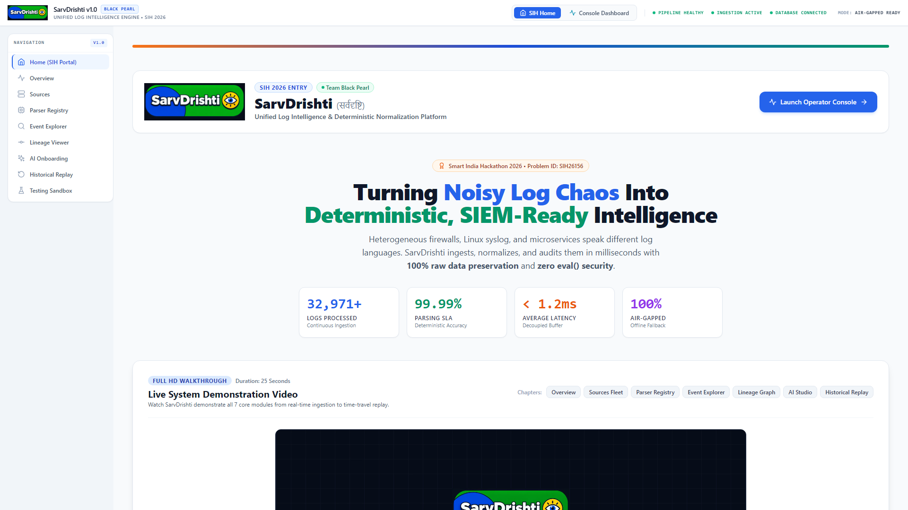
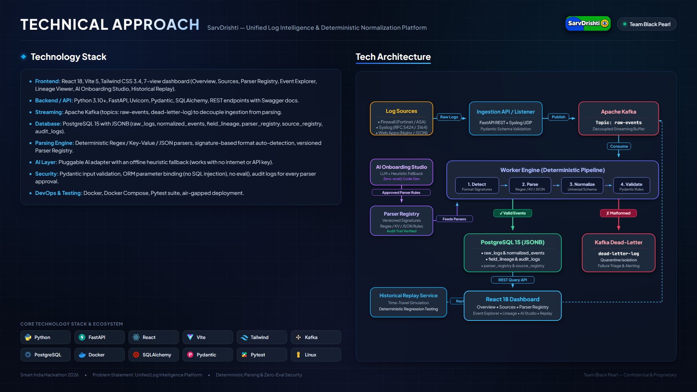
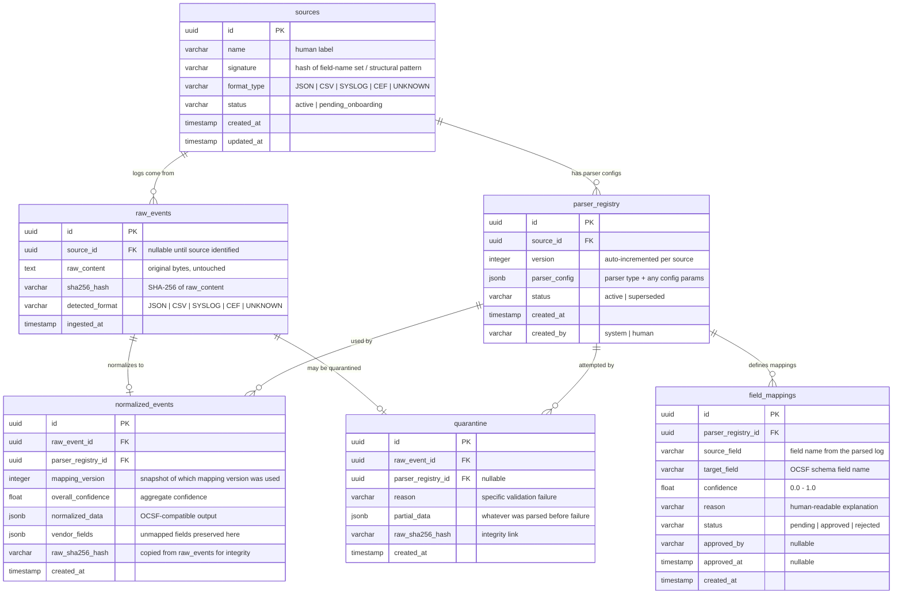

# SarvDrishti — Unified Log Intelligence & Normalization Engine
### Team Black Pearl | SIH 2026 Problem Statement: SIH26156

[](https://www.python.org/)
[](https://fastapi.tiangolo.com/)
[](https://reactjs.org/)
[](https://vitejs.dev/)
[](https://tailwindcss.com/)
[](https://kafka.apache.org/)
[](https://www.postgresql.org/)
[](https://www.docker.com/)

> **SarvDrishti** (सर्वदृष्टि — *"All-Seeing Vision"*) is an enterprise-grade, defensive log ingestion, parsing, normalization, field-level lineage tracking, and schema management platform built by **Team Black Pearl**. Designed to unify fragmented security telemetry into a single coherent view, SarvDrishti runs seamlessly on a single development machine (e.g. standard Windows 11 / Linux laptop with Docker Desktop), is fully containerized, 100% air-gapped capable, and production-ready.

<p align="center">
  
</p>

---

## 📚 Technical Documentation Index

All in-depth engineering documentation, architecture diagrams, test plans, and presentation assets are organized in the [`docs/`](docs/) directory:

| Document | Description |
| :--- | :--- |
| 🏗️ [**Architecture & Ingestion Pipeline**](docs/ARCHITECTURE.md) | High-level system topology, async streaming buffers, Kafka KRaft, and SIEM export |
| 🗂️ [**Universal Common Schema (ECS)**](docs/UNIVERSAL_SCHEMA.md) | Elastic Common Schema (ECS) mapping, data types, validation rules & unmapped bucket |
| 🔄 [**Data Flow & Event Lifecycle**](docs/DATA_FLOW.md) | Step-by-step trace of a raw log through detection, parsing, normalization, and lineage |
| 🧩 [**Deterministic Parser Design**](docs/PARSER_DESIGN.md) | Format signature detection, regex/KV/JSON parsers, and versioned registry rules |
| 🤖 [**AI Onboarding Studio Guide**](docs/AI_ONBOARDING.md) | Offline heuristic / LLM rule synthesis, automated validation, and human-in-the-loop approval |
| 🛡️ [**Air-Gapped Deployment Guide**](docs/AIR_GAPPED_DEPLOYMENT.md) | Zero-internet Docker Compose deployment, air-gapped AI heuristics, and zero eval() security |
| ⚙️ [**Project Setup & Developer Guide**](docs/PROJECT_SETUP.md) | Local rapid prototyping setup (Python 3.10+, FastAPI, Vite/React, SQLite/Postgres) |
| 🧪 [**Comprehensive Test Plan**](docs/TEST_PLAN.md) | Automated Pytest suite commands, synthetic log emitters, and test coverage matrix |
| 🎯 [**SIH26156 Requirement Matrix**](docs/SIH_REQUIREMENT_MATRIX.md) | Clause-by-clause traceability against the official Smart India Hackathon problem statement |
| ⚖️ [**SIH Claims & Defense Strategy**](docs/SIH_CLAIMS.md) | Technical defense and evidence for jury presentation |
| ❓ [**Jury Q&A Cheat Sheet (Top 20)**](docs/JURY_QA.md) | Rapid-fire answers for evaluation questions on ACID, Kafka, lineage, and scaling |
| 🎬 [**2-Minute Demo Script & Walkthrough**](docs/DEMO_SCRIPT.md) | Timed 2-minute pitch script + interactive step-by-step test sequence |
| 🔍 [**Implementation Verification Audit**](docs/IMPLEMENTATION_AUDIT.md) | Direct code execution audit verifying streaming, database, and UDP Syslog listener |
| ⚠️ [**Known Limitations & Future Scope**](docs/KNOWN_LIMITATIONS.md) | Transparent engineering analysis of prototype boundaries and production scale roadmap |
| 📊 [**Technical Approach Slide (Interactive HTML)**](docs/assets/technical_approach_slide.html) | Presentation slide layout with live technology badges and architecture diagram |

---

## 📌 Table of Contents
1. [Technical Documentation Index](#-technical-documentation-index)
2. [System Architecture & Data Flow](#-system-architecture--data-flow)
3. [Core Concepts & Problem Solved](#-core-concepts--problem-solved)
4. [Universal Common Event Schema](#-universal-common-event-schema)
5. [Database Schema & Entity Relationships](#-database-schema--entity-relationships)
6. [Dashboard Navigation Guide (7 Views)](#-dashboard-navigation-guide-7-views)
7. [Quickstart & How to Run](#-quickstart--how-to-run)
8. [Real-Time Integration & Live Testing Scripts](#-real-time-integration--live-testing-scripts)
9. [SIH26156 Requirement Coverage Matrix](#-sih26156-requirement-coverage-matrix)
10. [Jury Q&A Cheat Sheet (Top 20 Questions)](#-jury-qa-cheat-sheet-top-20-questions)
11. [Final 2-Minute Jury Demo Script](#-final-2-minute-jury-demo-script)
12. [Repository Directory Structure](#-repository-directory-structure)

---

## 🏗️ System Architecture & Data Flow

<p align="center">
  
</p>

```
                      +-------------------------------------------------+
                      |                 INGESTION LAYER                 |
                      |  1. File Upload API   2. Live Syslog (UDP 5140) |
                      |  3. Simulated Log Generators (FW, Linux, App)   |
                      +------------------------+------------------------+
                                               |
                                               v
                                    +--------------------+
                                    | Apache Kafka Broker|
                                    |  - raw-events      |
                                    +---------+----------+
                                              |
                                              v
                      +-------------------------------------------------+
                      |             WORKER ENGINE PIPELINE              |
                      | 1. Format Signature Auto-Detection              |
                      | 2. Parser Selection (Parser Registry)           |
                      | 3. Deterministic Extraction (Regex/KV/JSON)     |
                      | 4. Common Schema Normalization & Extension Dict  |
                      | 5. Validation Engine (Types, IPs, Ports, Dates) |
                      +------------------------+------------------------+
                                               |
                          +--------------------+--------------------+
                          |                                         |
                          v (SUCCESS / LOSSLESS)                    v (MALFORMED)
       +------------------------------------+             +--------------------+
       |          POSTGRESQL STORE          |             | Apache Kafka Broker|
       |  - raw_logs (Untouched Payload)    |             |  - dead-letter-log |
       |  - normalized_events (Universal)   |             +--------------------+
       |  - field_lineage (Field mapping)   |
       |  - parser_registry & source_reg    |
       +------------------+-----------------+
                          |
                          v
       +------------------------------------+
       |      EKDRISHTI REACT DASHBOARD     |
       | - Overview & Live EPS Tracker      |
       | - Event Explorer & Raw Visualizer  |
       | - Interactive Lineage Graph        |
       | - AI Onboarding & Approval Studio  |
       | - Historical File Replay Control   |
       +------------------------------------+
```

---

## 💡 Core Concepts & Problem Solved

### 1. Heterogeneous Log Ingestion
Enterprise security environments consist of devices from different vendors (Cisco ASA, Fortinet, Linux SSHD, NGINX). Each vendor outputs logs in a different format:
* **Firewall (Key-Value)**: `SRC=10.10.1.20 DST=172.16.2.10 ACTION=DENY`
* **Syslog (Text)**: `Aug 27 00:54:05 server01 sshd: Failed password for user admin`
* **Web Server (JSON)**: `{"method":"POST", "path":"/login", "user":"admin", "status":401}`

### 2. Universal Normalization
SarvDrishti translates all incoming formats into a **Single Standard Language** (aligned with Elastic Common Schema). Regardless of vendor, source IP is mapped to `source.ip` and username is mapped to `user.name`.

### 3. Lossless Processing Guarantee (0% Data Loss)
* The **exact untouched raw log string** is preserved with a cryptographic **SHA-256 hash** in `raw_logs`.
* Any vendor-specific extra fields that do not map to standard core schema attributes are stored in the **`unmapped`** JSON object. No fields are ever discarded.

### 4. Field-Level Lineage & Provenance
Every normalized record creates relational mapping entries in `field_lineage` linking:
$$\text{Normalized Field } (source.ip) \longleftarrow \text{Raw Key } (SRC) \longleftarrow \text{Parser } (firewall-kv-v1:1.0.0) \longleftarrow \text{Raw ID}$$

### 5. Decoupled AI Onboarding Layer
Production streaming is **100% deterministic** (compiled Python rules executing at thousands of logs/sec). AI is used **strictly for unknown source onboarding** to analyze sample payloads, suggest regex/mappings, run validation, and register production parsers for human approval.

---

## 🌐 Universal Common Event Schema

```json
{
  "event": {
    "id": "uuid-v4-string",
    "created": "2026-08-27T00:54:05.000000+00:00",
    "category": "network | authentication | web | system | custom_unknown",
    "action": "allow | deny | login_failed | login_success | HTTP POST /login",
    "outcome": "success | failure | unknown"
  },
  "source": { "ip": "10.10.1.20", "port": 4521 },
  "destination": { "ip": "172.16.2.10", "port": 443 },
  "network": { "protocol": "TCP" },
  "host": { "name": "blackpearl-workstation" },
  "user": { "name": "operator" },
  "parser": { "id": "linux-syslog-v1", "version": "1.0.0" },
  "source_id": "src-syslog-live",
  "raw_event_reference": {
    "raw_id": "raw-uuid-v4-string",
    "hash": "sha256-hex-digest-string"
  },
  "unmapped": {
    "process": "sshd[2410]"
  }
}
```

---

## 🗄️ Database Schema & Entity Relationships

The following diagram illustrates SarvDrishti's core database schema — how raw events flow through parsing, normalization, quarantine, and field mapping with full provenance tracking.



---

## 🖥️ Dashboard Navigation Guide (7 Views)

### 1. Overview
* **Metrics Cards**: Displays total events processed, Events Per Second (EPS), parsing success rate (99%+), active sources/parsers, and validation failure counts.
* **Infrastructure Health**: Shows live status indicators for Kafka, Workers, PostgreSQL, and Air-Gapped mode.

### 2. Sources
* **Ingestion Registry**: Cards displaying active bindings for Perimeter Firewall, Syslog UDP 5140, Web Server REST API, and Unknown Sources.

### 3. Parser Registry
* **Rule Store**: Displays active registered parsers (`firewall-kv-v1`, `linux-syslog-v1`, `web-application-v1`, `unknown-heuristic-v1`, dynamic custom parsers), versions (`1.0.0`), format names, and validation state (`PASSED`).

### 4. Event Explorer
* **Live Event Stream**: Displays incoming raw logs alongside normalized JSON records.
* **Details Box**: View untouched raw payload strings and click **View Field Lineage**.

### 5. Lineage Viewer
* **Provenance Graph**: Click any normalized field (e.g. `source.ip`) to inspect original raw keys (`SRC`), raw values (`10.10.1.20`), parser ID, version, and highlighted raw payload text.

### 6. AI Onboarding Studio
* **3-Step Onboarding**: Paste unknown log payload -> Click **Analyze with AI Adapter** -> Click **Run Automated Validation** -> Click **Approve & Register Parser**.

### 7. Historical Replay
* **Archive File Replayer**: Upload `sample_historical.log`, select target source, and watch the progress bar stream lines through Kafka into PostgreSQL.

---

## 🚀 Quickstart & How to Run

### Prerequisites
* Python 3.10+
* Node.js 18+ and npm
* Docker Desktop (optional for containerized mode)

---

### Option A: Standalone Local Mode (Fastest Zero-Setup)

#### 1. Backend Server Setup:
```bash
# In Terminal 1: Navigate to project root
cd sarvdrishti

# Install requirements
python3 -m pip install --user -r backend/requirements.txt

# Run Pytest verification suite
PYTHONPATH=backend python3 -m pytest backend/tests

# Start FastAPI server on port 8000
PYTHONPATH=backend python3 -m uvicorn app.main:app --host 0.0.0.0 --port 8000
```

#### 2. Frontend React Dashboard Setup:
```bash
# In Terminal 2: Navigate to frontend
cd sarvdrishti/frontend

# Install node dependencies and start Vite dev server
npm install
npm run dev
```

* **Dashboard URL**: `http://localhost:3000`
* **API Swagger Docs**: `http://localhost:8000/docs`

---

### Option B: Containerized Production Mode (Docker Compose)

```bash
# Build and launch all services (Postgres, Kafka, Backend, Frontend)
docker-compose up --build -d

# Check running container status
docker-compose ps

# Stop containers and clean volumes
docker-compose down -v
```

---

## ⚡ Real-Time Integration & Live Testing Scripts

### 1. Continuous Live Real-Time Laptop Syslog Streamer (Your Real OS Logs)
Tails your laptop's Linux system journal (`journalctl -f`) in real time and streams every new log event to UDP 5140:
```bash
python3 scripts/stream_my_real_syslog.py
```
*To run on another machine targeting your SarvDrishti instance:*
```bash
python3 scripts/stream_my_real_syslog.py --host <YOUR_LAPTOP_IP>
```

### 2. Continuous Real-Time Live Log Stream Generator (Firewall, Syslog, Web App)
Generates continuous live events every 1.5 seconds for live dashboard demonstration:
```bash
python3 scripts/live_stream_generator.py --delay 1.0
```

### 3. One-Time Real System Log Snapshot
Captures your machine's actual hostname, username, and local IP:
```bash
python3 scripts/send_real_system_logs.py
```

### 4. Historical Log File Replay Generator
Generates synthetic archive file `sample_historical.log` for file upload replay testing:
```bash
python3 scripts/generate_logs.py --mode file --count 100
```

---

## 📊 SIH26156 Requirement Coverage Matrix

| Requirement | Implementation Component | API / UI Endpoint | Expected Result | Status |
| :--- | :--- | :--- | :--- | :--- |
| **A. Raw Event Preservation** | `RawLogDB` table + `RawEventReference` | `POST /api/events/ingest` | Raw string payload preserved with SHA-256 hash | **PASS** |
| **B. Source-Specific Parsing** | `ParserRegistry` (`firewall`, `syslog`, `webapp`) | `registry.detect_format_and_parser()` | Format signature auto-detection routes to correct parser | **PASS** |
| **C. Universal Normalization** | `UniversalEvent` Pydantic Schema | `LosslessNormalizer.normalize()` | Standardized schema fields (`event`, `source`, `destination`, `user`) | **PASS** |
| **D. Field-Level Lineage** | `FieldLineageDB` relational table | `GET /api/events/lineage/{id}` | Links normalized key to raw key, parser ID, version & value | **PASS** |
| **E. Plug-and-Play Onboarding**| `AIOnboardingStudio` & `OnboardingService` | `POST /api/onboarding/analyze` | AI/Heuristic auto-discovers unknown log format & regex | **PASS** |
| **F. Unified Dashboard** | React SPA (`Overview.jsx`, `EventExplorer.jsx`) | Web Browser at `http://localhost:3000` | Real-time EPS, event stream, parser health & status | **PASS** |
| **G. SIEM / Data Lake Output** | REST Query API (`/api/events`) | `GET /api/events?limit=50` | Standardized JSON payload output ready for SIEM ingestion | **PASS** |
| **H. AI/ML-Ready Data** | Clean typed Pydantic Schema | `UniversalEvent.model_dump()` | Structured numeric ports, standardized timestamps & categories | **PASS** |
| **I. Parser Effort Reduction** | `HeuristicFallbackProvider` & AI Adapter | `POST /api/onboarding/approve` | Auto-generates parser rules in seconds for human approval | **PASS** |
| **J. Air-Gapped Operation** | Local FastAPI + Postgres + Heuristic AI | `OPENAI_API_KEY="" pytest backend/tests` | 100% execution without internet connection or cloud APIs | **PASS** |
| **K. Containerized Deployment**| `docker-compose.yml`, Dockerfiles | `docker-compose up --build` | Isolated containers for Postgres, Kafka, Backend, Frontend | **PASS** |

---

## 🎯 Jury Q&A Cheat Sheet (Top 20 Questions)

1. **Q: How does your system guarantee no information loss during log normalization?**  
   *Answer:* Dual-store architecture. We save the original untouched string payload with a SHA-256 hash in `raw_logs`, and any vendor fields not mapping to standard schema attributes are preserved in the `unmapped` JSON dictionary inside `normalized_events`.

2. **Q: Why don't you parse live streaming logs with an LLM?**  
   *Answer:* LLMs are slow (hundreds of ms per request), expensive, non-deterministic, and risk data leakage. SarvDrishti uses AI strictly for offline unknown log source onboarding to generate regex/schema rules. Once approved, production parsing runs deterministically at thousands of logs per second.

3. **Q: What happens when an incoming log format changes unexpectedly (Schema Drift)?**  
   *Answer:* The validation engine compares extracted fields against expected schema rules in the Parser Registry. Missing required fields or invalid data types trigger a Schema Drift warning flag and mark `is_valid: false`.

4. **Q: How does field-level lineage tracking work in SarvDrishti?**  
   *Answer:* For every event, SarvDrishti writes records to the `field_lineage` database table linking the normalized key (`source.ip`), raw payload key (`SRC`), raw value (`10.10.1.20`), parser ID, version, and foreign key to `raw_logs`.

5. **Q: Can SarvDrishti operate in a 100% air-gapped military or financial facility?**  
   *Answer:* Yes. All components (FastAPI backend, Kafka, Postgres, React frontend, and deterministic parsers) run inside local Docker containers. Unknown log onboarding uses an offline heuristic regex engine when no cloud API key is configured.

6. **Q: Why did you choose PostgreSQL over Elasticsearch?**  
   *Answer:* PostgreSQL delivers strong ACID relational integrity for parser versioning and field-level lineage lookup while offering JSONB query performance comparable to NoSQL for unmapped fields—keeping memory overhead well under 4GB on one laptop.

7. **Q: What is the purpose of Apache Kafka in your pipeline?**  
   *Answer:* Kafka acts as a streaming buffer to decouple high-volume ingestion (Syslog UDP, file upload API) from worker parsing, preventing dropped network sockets during traffic spikes.

8. **Q: How does SarvDrishti detect log formats automatically?**  
   *Answer:* `ParserRegistry` evaluates signature rules (e.g. `SRC=` keys for Firewall, RFC3164 month names for Syslog, JSON `{` for Web Apps) before falling back to the heuristic parser.

9. **Q: How are malformed events handled?**  
   *Answer:* Malformed events fail `EventValidator` checks, are saved in the database with `is_valid: false`, increment the validation failure counter, and route to Kafka's dead-letter queue.

10. **Q: How does historical file replay work?**  
    *Answer:* The admin uploads an archive file. `ReplayService` reads lines, pushes them to the Kafka queue with source attribution, and streams progress percentage to the dashboard.

11. **Q: What validation rules are enforced by the engine?**  
    *Answer:* IPv4/IPv6 syntax checks, port range bounds [1-65535], ISO timestamp parsing, required field presence, and unmapped dictionary preservation.

12. **Q: Can an administrator customize AI-generated field mappings before approval?**  
    *Answer:* Yes. The **AI Onboarding Studio** UI allows administrators to review proposed mappings, edit target schema keys, run test validation, and click **Approve & Register Parser**.

13. **Q: What happens if the backend server restarts?**  
    *Answer:* PostgreSQL persists all raw logs, normalized schema records, field lineage links, and parser versions. The dynamic parser registry reloads approved custom parsers on startup.

14. **Q: How are timestamps normalized across different time zones?**  
    *Answer:* All timestamps are transformed into ISO 8601 UTC format (`YYYY-MM-DDTHH:MM:SS.ffffff+00:00`).

15. **Q: What is the memory footprint of running SarvDrishti on a laptop?**  
    *Answer:* Standalone mode consumes ~250MB RAM. The full Docker Compose stack (Postgres, Kafka, Backend, Frontend) consumes ~1.8GB RAM.

16. **Q: How do you prevent security vulnerabilities like SQL injection or command injection?**  
    *Answer:* All database queries use SQLAlchemy parameter binding/ORM calls, Pydantic type validation sanitizes API inputs, and no shell `eval()` operations are used in parser execution.

17. **Q: Is the common schema aligned with industry standards?**  
    *Answer:* Yes, the Universal Schema is modeled after the Elastic Common Schema (ECS) standard (`event`, `source`, `destination`, `network`, `host`, `user`).

18. **Q: What is the performance impact of lossless unmapped field preservation?**  
    *Answer:* Minimal. Unmapped key-value pairs are stored as lightweight JSON objects directly in PostgreSQL JSONB fields.

19. **Q: How do you audit parser approvals?**  
    *Answer:* Every parser approval creates a record in the `audit_logs` database table capturing timestamp, administrator action, parser ID, and version.

20. **Q: Why is SarvDrishti suitable for SIH 2026 problem statement SIH26156?**  
    *Answer:* It satisfies all official requirements: heterogeneous log ingestion, lossless raw event preservation, universal ECS normalization, field-level lineage, plug-and-play AI onboarding, air-gapped containerization, and unified visibility on a single laptop setup.

---

## 🎬 Final 2-Minute Jury Demo Script

1. **0:00 - 0:25 (Overview & Real System Ingestion)**:  
   *Open SarvDrishti Dashboard at `http://localhost:3000`.*  
   *Run `python3 scripts/stream_my_real_syslog.py` live.*  
   *Open **Event Explorer**. Show your actual laptop hostname and IP appearing in the live event stream!*

2. **0:25 - 0:50 (Field Lineage & Untouched Raw Preservation)**:  
   *Select the live Syslog or Firewall event in **Event Explorer** and click **View Field Lineage**.*  
   *Show the jury that `source.ip` maps directly to raw token `from` parsed by `linux-syslog-v1`, linking to the exact SHA-256 raw event hash.*

3. **0:50 - 1:20 (AI-Assisted Unknown Source Onboarding)**:  
   *Open **AI Onboarding Studio**.*  
   *Paste custom log payload: `[AUDIT] user=john op=DELETE file=secret.doc host=10.0.0.5 timestamp=1724667616 status=FAIL`.*  
   *Click **Analyze with AI Adapter** -> **Run Automated Validation** -> **Approve & Register Parser**. Show the jury that dynamic rules are generated and deployed in under 5 seconds.*

4. **1:20 - 1:45 (Historical Archive File Replay)**:  
   *Open **Historical Replay** tab.*  
   *Upload `sample_historical.log` and click **Start Replay Pipeline**. Show the progress bar streaming file lines through Kafka and committing events to PostgreSQL.*

5. **1:45 - 2:00 (Air-Gapped Containerization & Summary)**:  
   *Point out the "AIR-GAPPED MODE READY" badge.*  
   *Conclude: "SarvDrishti delivers multi-source ingestion, universal normalization, 0% information loss, field-level lineage, AI onboarding, and air-gapped containerization on one standard laptop."*

---

## 📁 Repository Directory Structure

```
SarvDrishti/
├── README.md                          # Main project documentation & quickstart
├── docker-compose.yml                 # Multi-container orchestration (Kafka, Postgres, FastAPI, React)
├── sample_historical.log              # Sample log archive for historical file replay testing
├── .gitignore                         # Production gitignore (Python, Node, DBs, Virtualenvs)
├── backend/                           # High-performance FastAPI backend engine
│   ├── Dockerfile                     # Container definition for Python backend
│   ├── requirements.txt               # Backend dependencies (FastAPI, SQLAlchemy, Pydantic, Kafka, etc.)
│   ├── app/
│   │   ├── main.py                    # Application entrypoint & UDP Syslog listener lifecycle
│   │   ├── api/                       # REST endpoints (events, sources, parsers, replay, stats, testing)
│   │   ├── core/                      # Pydantic Universal Schema model & EventValidator
│   │   ├── db/                        # SQLAlchemy async database session & models
│   │   ├── engine/                    # Deterministic Normalizer & unmapped field preservation
│   │   ├── parsers/                   # Base parser, Firewall, Syslog, Web App, Heuristic & Registry
│   │   ├── kafka/                     # Kafka producer & background consumer worker loop
│   │   ├── ai/                        # Pluggable offline/online AI adapter
│   │   └── services/                  # Business logic (event, syslog, replay, onboarding)
│   └── tests/                         # Pytest test suite (parsers, normalizer, api)
├── frontend/                          # React 18 + Vite + TailwindCSS operator dashboard
│   ├── Dockerfile                     # Multi-stage production container with Nginx
│   ├── nginx.conf                     # Production reverse proxy config
│   ├── package.json                   # Frontend dependencies (@react-three, lucide, tailwind)
│   ├── vite.config.js                 # Vite bundler config with backend API proxy
│   ├── tailwind.config.js             # Custom theme tokens (dark/light mode palettes)
│   ├── index.html                     # HTML root template with fonts & metadata
│   ├── public/                        # Static assets (logo.png, technical_approach_slide.html)
│   └── src/                           # React source code
│       ├── main.jsx                   # React DOM root entry
│       ├── App.jsx                    # Top bar, view routing, global navigation
│       ├── index.css                  # Global styles & Tailwind directives
│       └── components/                # 8 Dashboard Views
│           ├── HomePage.jsx           # Landing overview & quick demo showcase
│           ├── Overview.jsx           # Live system health, EPS meters, Kafka counters
│           ├── SourcesView.jsx        # Configured telemetry source management
│           ├── ParserRegistryView.jsx # Versioned parser rules & signature inspection
│           ├── EventExplorer.jsx      # Real-time event grid & JSON inspect modal
│           ├── LineageViewer.jsx      # Visual raw token -> schema field provenance
│           ├── AIOnboardingStudio.jsx # Unknown log analysis, validation & approval
│           └── HistoricalReplayView.jsx # Log file archive streaming & progress tracking
├── scripts/                           # Live test generators & automation tools
│   ├── generate_logs.py               # Multi-vendor test log emitter (API & file modes)
│   ├── send_real_system_logs.py       # Live UDP Syslog socket test client
│   ├── stream_my_real_syslog.py       # Local workstation telemetry streamer
│   ├── live_stream_generator.py       # Continuous background event generator
│   ├── generate_slide.py              # Presentation slide generator
│   └── generate_web_video.py          # Demo video animation generator
└── docs/                              # Detailed engineering documentation & visual assets
    ├── assets/                        # Screenshots, video demo, slide HTML & logos
    │   ├── homepage_preview.png       # Dashboard UI preview screenshot
    │   ├── technical_approach_slide.png # Architecture & approach slide
    │   ├── dark_mode_home.png         # Dark mode UI capture
    │   ├── light_mode_full.png        # Full light mode capture
    │   ├── primary_light_mode.png     # Primary light mode capture
    │   ├── sih_white_theme_preview.png# White theme presentation preview
    │   ├── technical_approach_slide.html # Standalone presentation slide
    │   ├── web_video.mp4              # Demonstration video MP4
    │   └── logo.png                   # Official SarvDrishti emblem
    ├── ARCHITECTURE.md                # In-depth architectural design & SIEM integration
    ├── DATA_FLOW.md                   # Step-by-step event lifecycle & state transitions
    ├── UNIVERSAL_SCHEMA.md            # Comprehensive ECS schema dictionary & data types
    ├── PARSER_DESIGN.md               # Deterministic parsing rules & signature patterns
    ├── AI_ONBOARDING.md               # Dynamic parser synthesis & approval workflow
    ├── AIR_GAPPED_DEPLOYMENT.md       # Zero-internet standalone deployment guide
    ├── PROJECT_SETUP.md               # Local developer onboarding & troubleshooting
    ├── TEST_PLAN.md                   # Test matrix & automated verification commands
    ├── JURY_QA.md                     # Top 20 defense answers for jury evaluation
    ├── DEMO_SCRIPT.md                 # 2-minute pitch & step-by-step interactive test sequence
    ├── SIH_CLAIMS.md                  # Requirement defense strategy for problem SIH26156
    ├── SIH_REQUIREMENT_MATRIX.md      # Detailed requirement traceability breakdown
    ├── IMPLEMENTATION_AUDIT.md        # Technical execution audit report
    └── KNOWN_LIMITATIONS.md           # Engineering trade-offs & production scaling roadmap
```

---

<p align="center">
  <strong>Built with ⚓ by Team Black Pearl</strong><br/>
  <em>SIH 2026 — Problem Statement SIH26156</em>
</p>
